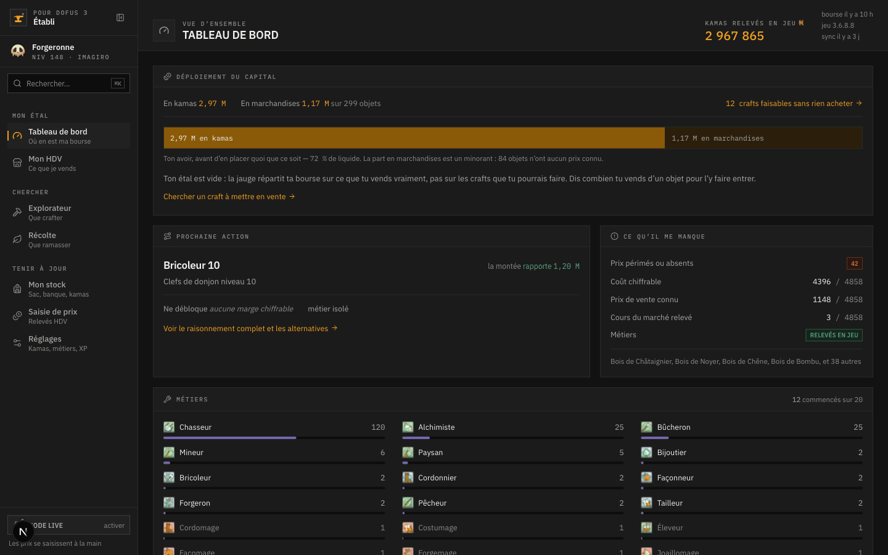
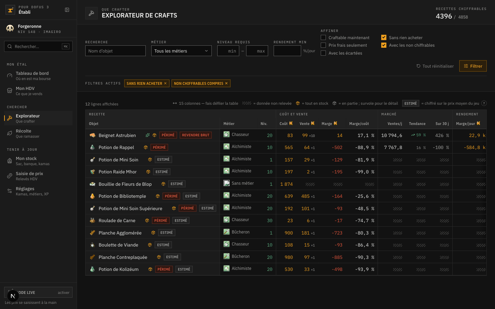
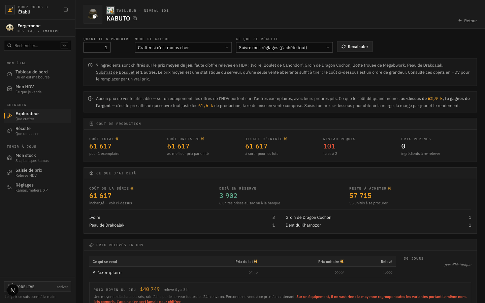
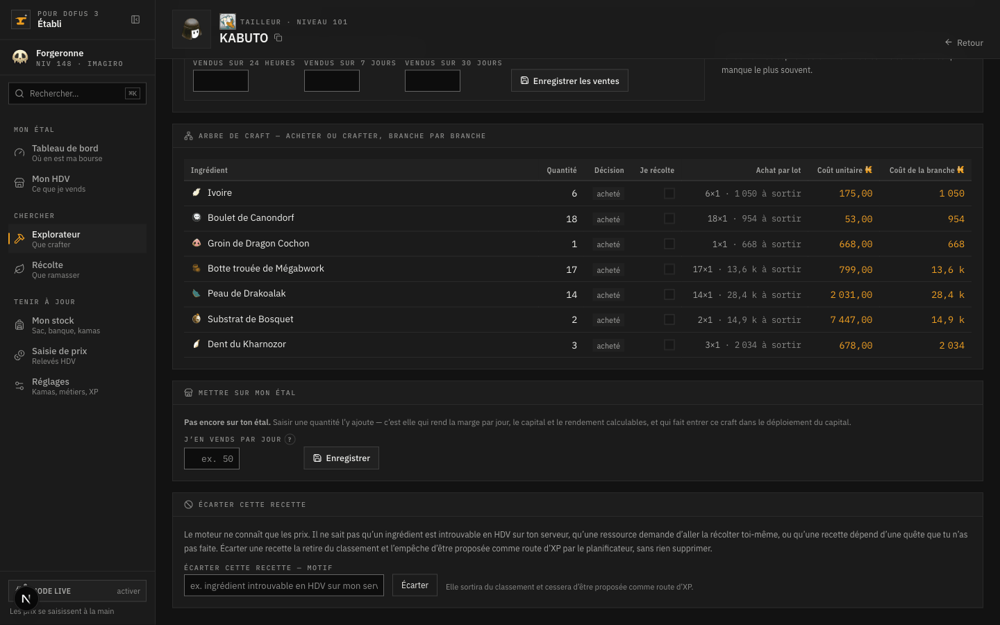
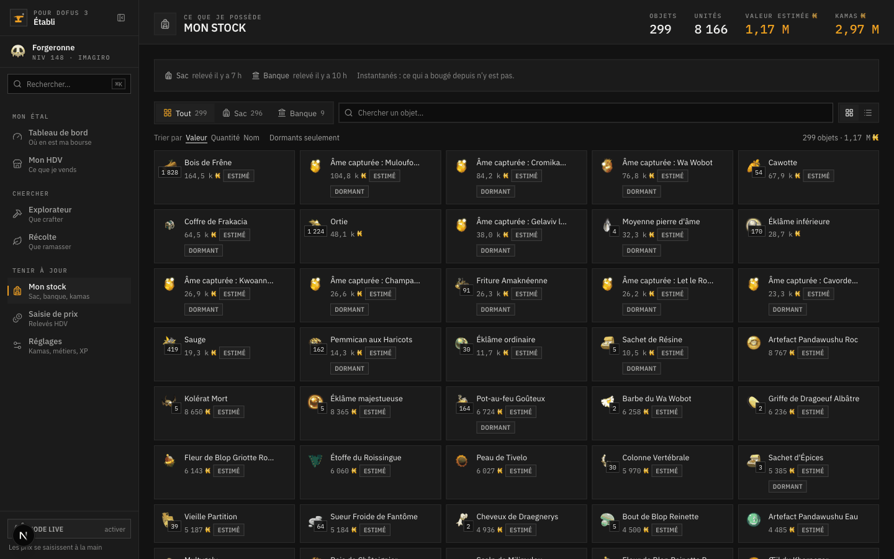
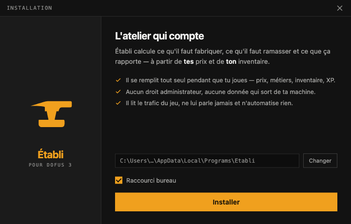
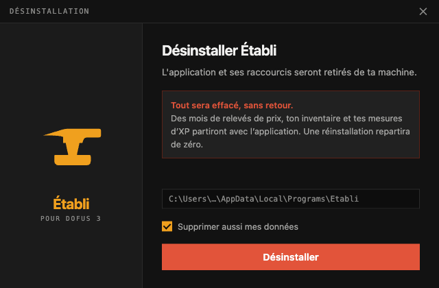
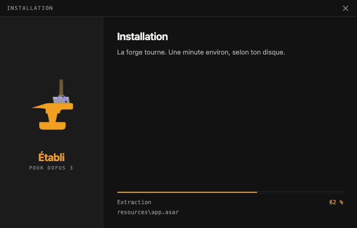

# Établi — téléchargements

**L'atelier qui compte.** Aide à la décision pour l'artisanat de Dofus 3 : ce qu'il
faut fabriquer, ce qu'il faut ramasser, et ce que ça rapporte vraiment.

👉 **[Télécharger la dernière version](../../releases/latest)**

Ce dépôt ne contient **que les binaires**. Le code source vit ailleurs.

---

## À quoi ça ressemble

### Le tableau de bord — où en est ta bourse

Ce que tu as en kamas, ce que tu as en marchandises, et la seule action qui vaut
le coup ensuite. Les chiffres viennent du jeu : kamas, niveaux de métier,
inventaire et XP se relèvent tout seuls pendant que tu joues.

### L'explorateur — 4 858 recettes, classées par ce qu'elles rapportent

Coût de production, prix de vente, marge, rendement par jour. Filtre sur ce que
tu peux fabriquer **maintenant**, à ton niveau, ou sur ce que tu peux fabriquer
**sans rien acheter** parce que tout est déjà dans ton stock.

### La fiche d'un craft — le coût, et ce qu'il cache

Le **coût de production** n'est pas le **ticket d'entrée** : un ingrédient vendu
par lots de 10 coûte dix fois son prix unitaire à sortir, et le reste part en
stock. L'app sépare les deux, dit ce que tu as déjà, et ce qui reste à acheter.

### L'arbre de craft — acheter ou fabriquer, branche par branche

Chaque ingrédient est chiffré au meilleur prix unitaire, toutes tailles de lot
confondues. Un ingrédient qui se fabrique pour moins cher qu'il ne s'achète est
descendu d'un cran, et l'arbre suit.

### Ton stock — sac, banque et kamas, relevés en jeu

Tes objets, leur valeur estimée, et ce qui dort depuis des semaines. Rien à
saisir : l'app lit ce que le jeu t'envoie déjà.

---

## Quel fichier prendre

| Ton système | Le fichier |
|---|---|
| Windows | `Etabli-<version>-win-x64-setup.exe` — l'installateur |
| Windows, sans installer | `Etabli-<version>-win-x64.zip` — à dézipper, portable |
| macOS (Apple Silicon) | `Etabli-<version>-arm64.dmg` |

## L'installation

L'installateur est maison. Il se pose dans ton dossier utilisateur : **aucun droit
administrateur** n'est demandé, et rien n'est écrit ailleurs que chez toi.

| Installer | Désinstaller |
|---|---|
|  |  |

## Au premier lancement

Les paquets ne sont **pas signés par un certificat payant** — c'est une app entre
amis, pas un logiciel commercial. Chaque système s'en méfie une fois :

- **Windows** : « Windows a protégé votre ordinateur » → **Informations
  complémentaires** → **Exécuter quand même**.
- **macOS** : au premier lancement, **Réglages Système › Confidentialité et
  sécurité** → **Ouvrir quand même**. Si macOS dit que l'app est « endommagée »,
  c'est la quarantaine : `xattr -cr "/Applications/Établi.app"`.

## Le mode live

L'app peut se remplir toute seule pendant que tu joues — prix, cours du marché,
niveaux de métier, inventaire, kamas, et l'XP réellement gagnée. Elle **lit
passivement** le trafic que ton client Dofus reçoit déjà : elle ne parle jamais au
jeu, n'injecte rien, ne lit aucune mémoire et n'automatise aucune action.

Pour ça il faut **[Npcap](https://npcap.com/#download)** sur Windows (gratuit,
options par défaut). L'installateur te le rappelle s'il manque. Sur macOS, une
autorisation unique est demandée au premier passage en capture.

Tout fonctionne aussi sans : les prix se saisissent alors à la main.

## Tes données

Elles restent **chez toi**, dans une base locale — rien n'est envoyé nulle part.

Une désinstallation **ne les efface pas** : des mois de relevés de prix, ton
inventaire et tes mesures d'XP vivent à part, et une réinstallation les retrouve.
Si tu veux vraiment tout enlever, le désinstallateur propose de les emporter
aussi — c'est une case à cocher, jamais le comportement par défaut.

## Les mises à jour

L'app regarde ici s'il existe une version plus récente et te le dit, sans rien
installer d'autorité. Le téléchargement reste un geste volontaire.
